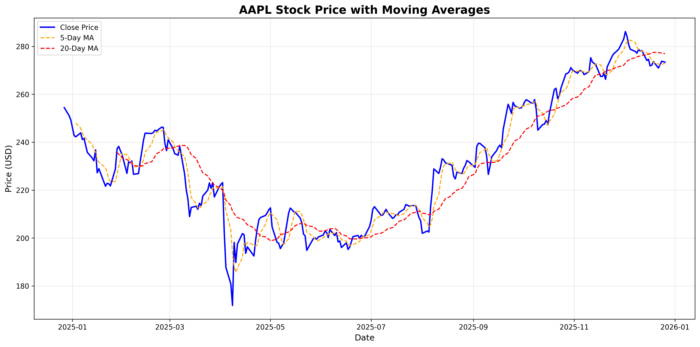

# Stock Price Analyzer

A Python-based stock price analysis tool that downloads historical data, calculates moving averages, detects trading patterns, and visualizes trends.

## Features

- 📊 Download stock data from Yahoo Finance
- 📈 Calculate 5-day and 20-day moving averages
- 🎯 Detect trading patterns (Golden Cross, Dead Cross)
- 📉 Generate professional charts with trend analysis
- 💾 Export data to CSV format

## Installation
```bash
pip3 install -r requirements.txt
```

## Usage
```bash
python3 stock_analyzer.py
```

The program will:
1. Download 1 year of AAPL stock data
2. Calculate moving averages
3. Detect trading patterns
4. Generate and save a chart to `data/AAPL_analysis.png`

## Example Output

### Chart


### Pattern Detection
```
🎯 Found 1 pattern(s):

  📅 Date: 2025-12-17 00:00:00-05:00
  📊 Type: Dead Cross
  💵 Price: $271.84
  📝 Sell signal: Short-term MA crossed below long-term MA
```

## Technical Stack

- Python 3.11
- pandas - Data manipulation
- yfinance - Stock data retrieval
- matplotlib - Data visualization
- numpy - Numerical computing

## Project Structure
```
stock-price-analyzer/
├── README.md
├── requirements.txt
├── stock_analyzer.py
└── data/
    ├── AAPL_stock_data.csv
    └── AAPL_analysis.png
```

## Future Enhancements

- [ ] Real-time monitoring system
- [ ] Multiple stock symbols support
- [ ] Email/SMS alerts for pattern detection
- [ ] More advanced pattern recognition algorithms
- [ ] Web dashboard interface

## 🔗 Author

**Tatsu**

GitHub: [@code-craftsman369](https://github.com/code-craftsman369)  
X: [@web3_builder369](https://twitter.com/web3_builder369)

## License

MIT License